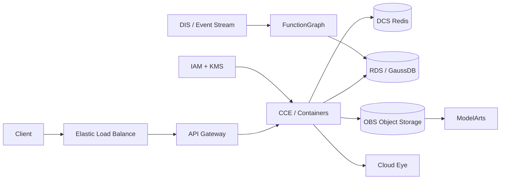

# Huawei Cloud ML Lab

A vendor-specific reference architecture for running the same ML workload on Huawei Cloud.

## Core services demonstrated

- VPC, subnets, security groups and ELB
- CCE for Kubernetes workloads
- FunctionGraph for event-driven compute
- OBS for model/data artifacts
- RDS / GaussDB for relational persistence
- DCS for Redis-compatible caching
- ModelArts for ML training/deployment workflows
- DIS/event-stream patterns
- IAM, KMS and Cloud Eye for security/observability

The codebase mirrors the AWS, GCP and Azure platform variants so vendor translation is explicit rather than hand-wavy.
