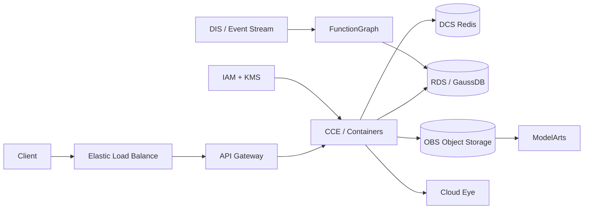

# Huawei Cloud ML Lab

A runnable policy and deployment-planning toolkit for taking an ML inference workload to Huawei
Cloud. It turns architecture claims into validated configuration, an auditable service plan,
security-aware CCE manifests and a FunctionGraph-compatible OBS event boundary.

A vendor-specific reference architecture for running the same ML workload on Huawei Cloud.



## Core services demonstrated

- VPC, subnets, security groups and ELB
- CCE for Kubernetes workloads
- FunctionGraph for event-driven compute
- OBS for model/data artifacts
- RDS / GaussDB for relational persistence
- DCS for Redis-compatible caching
- ModelArts for ML training/deployment workflows
- DIS/event-stream patterns
- IAM, KMS and Cloud Eye for security/observability

The codebase mirrors the AWS, GCP and Azure platform variants so vendor translation is explicit rather than hand-wavy.

## What works

- typed JSON deployment configuration with unknown/missing-key rejection
- production gates for private databases, KMS, HA, backups, replicas and autoscaling
- deterministic mapping from workload requirements to Huawei Cloud services
- CCE Deployment and HPA manifests with non-root/read-only security controls
- FunctionGraph-compatible normalization of OBS object events
- dev and production configuration examples
- CLI failure code when a plan violates blocking policies
- Python 3.11–3.13 CI, manifest validation, tests and wheel build

## Run it

```bash
python -m venv .venv
. .venv/bin/activate
pip install -e '.[dev]'
ruff check .
pytest
python scripts/validate_manifests.py
huawei-ml-plan configs/prod.json
```

`deployable: false` makes the CLI exit with code `2` unless
`--allow-policy-errors` is supplied. Warnings remain visible without blocking development
environments.

## Policy examples

| Code | Severity in prod | Control |
|---|---:|---|
| `NET001` | error | RDS/GaussDB must be private |
| `ENC001` | error | model/data artifacts require KMS |
| `HA001` | error | at least three inference replicas |
| `HA002` | error | highly available database |
| `DR001` | error | at least seven days of backups |
| `SCALE001` | error | CCE autoscaling enabled |

The repository does not claim that a local validator provisions cloud resources. It makes the
deployment contract reviewable and testable before provider credentials or Terraform state are
introduced.


## Idempotent OBS event admission

OBS notifications and FunctionGraph retries are treated as at-least-once delivery. `cloud_lab.event_admission` derives a stable SHA-256 event identity from the bucket, decoded object key, event name and immutable `versionId` or `eTag`, then claims it through an atomic storage boundary before downstream work starts.

```python
from cloud_lab.event_admission import InMemoryClaimStore, admit_obs_event

report = admit_obs_event(event, InMemoryClaimStore(), now=1_800_000_000.0)
assert report["accepted"] == 1
```

The admission layer rejects unsupported event types, missing object identities, oversized batches and duplicates inside the same notification. Replayed notifications produce an explicit `duplicate` decision instead of scheduling the job again. Reports are deterministic and JSON-ready for logs or audit evidence.

`InMemoryClaimStore` is only a thread-safe local reference implementation. Production deployments must back the `ClaimStore` protocol with a shared store whose claim is one atomic conditional write and whose retention exceeds the provider retry window. A read-then-write implementation is race-prone. Expired claims permit reprocessing, so downstream side effects should still use object-version-aware writes or transactions where available.
